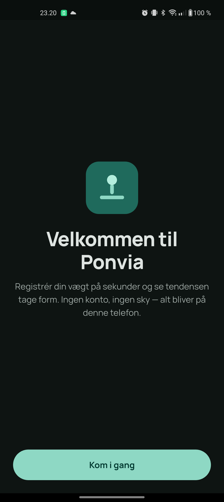
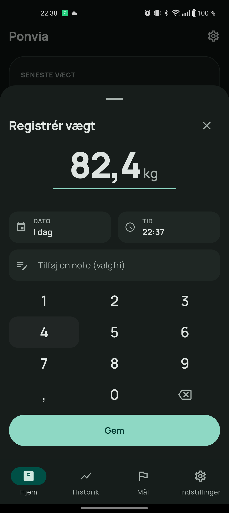
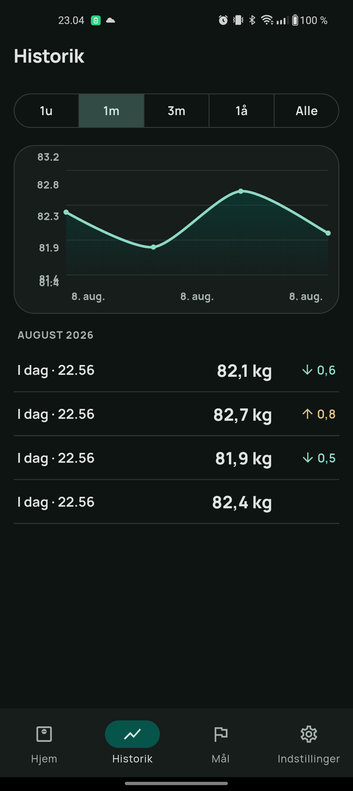
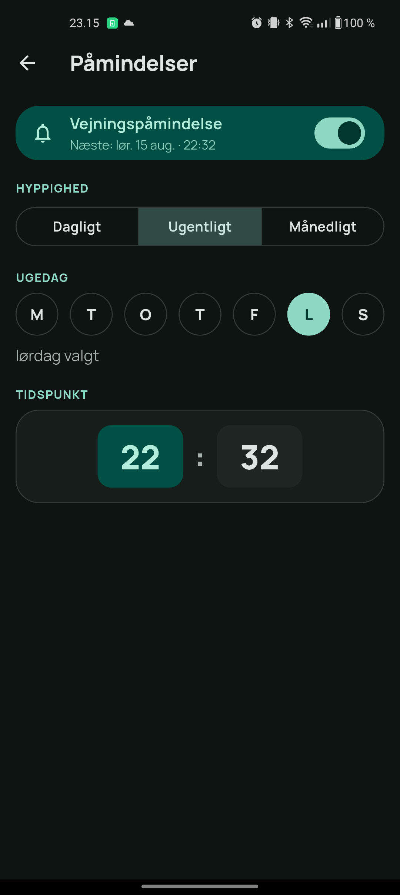
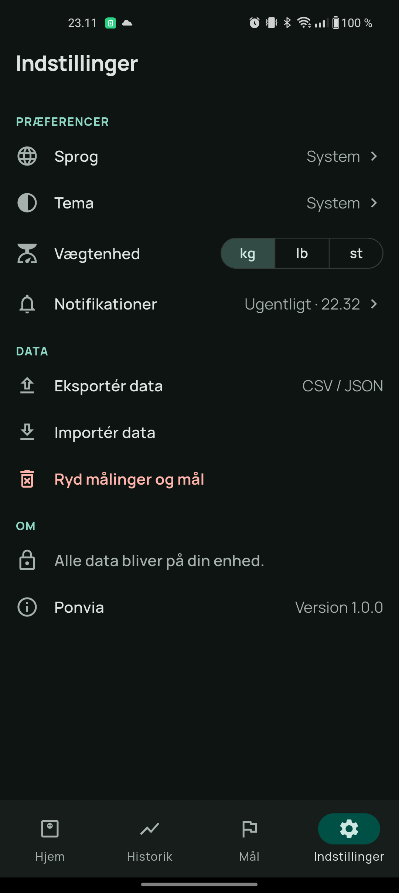

# Ponvia

A private, **offline weight-tracking app** for Android (iOS-capable), built with Flutter.
Ponvia keeps your **latest weight front and center**, with goals and a trend to give that
number meaning. Everything stays on your device — no accounts, no cloud, no network.
Calorie tracking is planned for a later phase.

<p align="center">
  
  
  
  
  
</p>

## Features

- **Weight-first home** — latest weight as the hero, change vs the previous entry, a
  recent-trend sparkline, and progress toward your closest goal.
- **Fast logging** — a custom in-app number pad (no OS keyboard), editable date/time, and
  optional notes. Edit or delete any entry.
- **History** — an interactive trend chart (1W / 1M / 3M / 1Y / All) plus month-grouped
  entries with per-entry deltas.
- **Goals** — keep several targets; the one closest to your current weight is highlighted.
  Mark goals achieved and see distance-to-target.
- **Weigh-in reminders** — local notifications: daily, weekly (pick the weekday), or
  monthly (pick the day), at a time you choose. Survives reboots; a tap opens the log sheet.
- **English & Danish**, light / dark / system theme, and **kg / lb / st** units.
- **Your data, portable** — JSON backup (weights, goals, settings) + CSV export; import
  with merge or replace.

## Privacy

Ponvia makes **no network calls**. All data is stored locally in an on-device database;
the only way data leaves the device is a backup you explicitly export.

## Tech stack

Flutter 3.44 / Dart 3.12 · Riverpod · Drift (SQLite) · go_router · Material 3 ·
`gen_l10n` (en/da) · fl_chart · flutter_local_notifications. Design system (Manrope type,
sea-green palette, bottom-tab navigation) in [`design/handoff/`](design/handoff/README.md).
Rationale for each choice is in [docs/DECISIONS.md](docs/DECISIONS.md).

## Install (Android)

Grab the latest **APK** from the [Releases](../../releases) page (each release includes a
QR code — scan it with your phone to download). Open the APK to install; you may need to
allow installing from unknown sources, and Android may warn about the installer source,
which is expected for a sideloaded app.

Releases are signed with a stable upload key, so **new versions install right over the old
one** without losing your data — no uninstall needed. The app is **portrait-only**.

## Build & run from source

Requires the Flutter SDK (3.44.x). See [CLAUDE.md](CLAUDE.md) for the exact toolchain.

```bash
flutter pub get
flutter run -d <android-device-id>   # debug build on a connected phone
flutter analyze
flutter test
```

Cutting a release: bump [CHANGELOG.md](CHANGELOG.md), then push a `v*` tag
(e.g. `git tag v0.1.0 && git push origin v0.1.0`). The
[release workflow](.github/workflows/release.yml) builds the APK, generates a changelog
and an install QR, and publishes a GitHub Release.

## Documentation

| Doc | What's in it |
|-----|--------------|
| [docs/SPEC.md](docs/SPEC.md) | Product spec: features + acceptance criteria |
| [docs/ARCHITECTURE.md](docs/ARCHITECTURE.md) | Layers, data model, deps, i18n, notifications |
| [docs/DECISIONS.md](docs/DECISIONS.md) | ADR-style rationale for every technical choice |
| [docs/MILESTONES.md](docs/MILESTONES.md) | Roadmap M0–M5 (all complete) |
| [design/handoff/](design/handoff/README.md) | The design system + mockups the UI is built from |

## Status

**Released — v0.1.1** is live on the [Releases](../../releases) page (signed, installs
in place). Milestones **M0–M5 are complete**: the app is fully built, localized, designed,
and verified on-device (Android). iOS is supported by the codebase but not yet built
(needs a Mac).

**Next up:** calorie tracking — the planned phase-2 feature (Home already shows a
"Kalorier — kommer snart" placeholder). Smaller backlog: a licenses page, multi-weekday
reminders, and `st + lb` split input.
